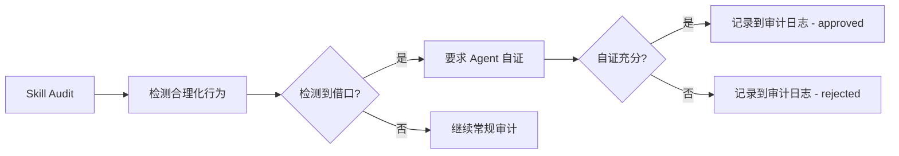
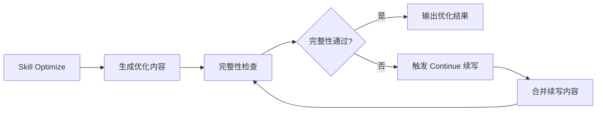

# Skill Cleaner 三件套增强文档 v3.6.1

> **版本**：v3.6.1
> **日期**：2026-06-15
> **作者**：SelfClaw Architecture Team
> **基于**：Agent World 市场调研（addyosmani/agent-skills + Leonxlnx/taste-skill）

---

## 摘要

本文档描述 SelfClaw v3.6.1 为 Skill Cleaner 三件套新增的两个独立机制模块：

1. **反合理化表（Anti-Rationalization Table）**：解决 Agent 用"改动小"跳测试的问题
2. **强制完整输出（Forced Complete Output）**：解决 LLM 长输出中途截断的老大难

---

## 一、反合理化表（Anti-Rationalization Table）

### 1.1 机制原理

来源：[addyosmani/agent-skills](https://github.com/addyosmani/agent-skills)（TDD/Code Review 技能集）

**核心问题**：Agent 在「跳过测试」「省略步骤」「忽略 lint」等场景下，常常用"改动小"等借口来合理化自己的行为。

**解决方案**：建立一个「反合理化表」，包含 10 条高频借口及其对应的反证话术。当检测到 Agent 使用这些借口时，必须显式引用反证话术，并将选择记录到审计日志。

### 1.2 反合理化表内容（10 条）

| # | 借口类型 | 借口描述 | 反证话术 |
|---|---------|---------|---------|
| 1 | skip_test | 改动很小，不需要测试 | 任何改动都可能引入 bug，无论改动大小。TDD 要求每次改动都必须有测试覆盖。 |
| 2 | skip_test | 暂时跳过测试，后续再加 | 测试不能跳过。没有测试的代码是不可维护的。要么写测试，要么不写代码。 |
| 3 | skip_test | 这个逻辑非常显而易见，不需要测试 | 显而易见的逻辑往往是最容易出错的地方。自动化测试不是为了验证显而易见，而是为了防止意外退化。 |
| 4 | omit_step | 省略某些步骤，简化流程 | 每个步骤都有其存在的理由。省略步骤可能隐藏重要逻辑，导致生产环境问题。 |
| 5 | ignore_lint | 忽略 lint 警告，以后再修 | Lint 警告是代码质量的信号灯。忽略它们会积累技术债，最终导致难以维护的代码。 |
| 6 | assume_safe | 应该没问题，不用验证 | 不能用'应该'来替代验证。计算机程序需要确定性，不能依赖模糊的信心。 |
| 7 | copy_paste | 直接复制粘贴就行，不用重写 | 复制粘贴是技术债的源头。即使代码相似，也应该理解后重构，而不是盲目复制。 |
| 8 | lazy | 懒得写测试了，反正能跑通 | '懒得'是质量下降的开始。现在的懒惰会以加倍的维护成本偿还。 |
| 9 | lazy | 这只是临时方案，很快会改 | 临时方案往往会变成永久方案。如果真的是临时的，应该设置过期时间或立即重构。 |
| 10 | skip_test | 不影响核心功能，不需要测试 | 不影响核心功能的改动可能影响性能、安全性或边缘场景。全面测试是专业开发者的标准。 |

### 1.3 API 使用示例

```typescript
import {
  detectRationalization,
  verifySelfJustification,
  logAntiRationalization,
  getAntiRationalizationReport,
  auditSkillRationalization,
  runAuditWithRationalizationCheck,
} from './skill-anti-rationalization.js';

// 1. 检测文本中的合理化行为
const detection = detectRationalization("改动很小，不需要测试", "my-skill");
if (detection.detected) {
  console.log('检测到借口:', detection.matchedEntry?.excuseDescription);
  console.log('建议的反证:', detection.suggestedArgument);
}

// 2. 验证 Agent 的自证是否充分
const agentResponse = "虽然改动小，但我会添加测试覆盖来验证正确性";
const verification = verifySelfJustification(detection, agentResponse);
if (verification.approved) {
  console.log('自证通过');
} else {
  console.log('自证不充分:', verification.reason);
}

// 3. 记录到审计日志
logAntiRationalization(
  "my-skill",
  detection,
  agentResponse,
  verification.approved ? 'approved' : 'rejected',
  verification.reason
);

// 4. 获取审计报告
const report = getAntiRationalizationReport();
console.log('总检测数:', report.totalDetections);
console.log('拒绝数:', report.rejectedCount);

// 5. 在 Skill Audit 中集成反合理化检查
import { runAuditWithRationalizationCheck } from './skill-audit.js';
const auditReport = runAuditWithRationalizationCheck(config);
```

### 1.4 与 skill-audit.ts 集成

在 `skill-audit.ts` 中新增以下导出：

```typescript
// 新增导出函数
export function auditSkillRationalization(
  skillName: string,
  skillBody: string,
  agentResponse?: string
): {
  detection: AntiRationalizationDetection;
  verification?: { approved: boolean; reason: string };
};

export function runAuditWithRationalizationCheck(
  config: AuditConfig,
  agentResponses?: Map<string, string>
): AuditReport;

export function getRationalizationAuditReport(): AntiRationalizationReport;
export function getRationalizationMarkdownReport(): string;
```

---

## 二、强制完整输出（Forced Complete Output）

### 2.1 机制原理

来源：[Leonxlnx/taste-skill](https://github.com/Leonxlnx/taste-skill)（强制完整输出技能）

**核心问题**：LLM 在生成长输出时常常中途截断，导致：
- Markdown 文档不完整
- 代码块未闭合
- JSON 格式错误
- 列表项截断

**解决方案**：提供 4 种完整性检查启发式 + 「Continue 续写」机制，确保输出完整。

### 2.2 完整性检查启发式（4 种）

| # | 启发式类型 | 检查内容 | 严重程度 |
|---|----------|---------|---------|
| 1 | `sentence_ending` | 句末标点检查 | critical |
| 2 | `code_block_closure` | 代码块闭合检查 | critical |
| 3 | `markdown_balance` | Markdown 平衡检查 | warning |
| 4 | `json_brace_balance` | JSON 大括号平衡检查 | critical |

**完整性分数计算**：
- Critical 问题：每个 -30 分
- Warning 问题：每个 -10 分
- Info 问题：每个 -5 分
- 分数 ≥ 80：通过检查

**建议操作**：
- 有 critical 问题 → `continue`（需要续写）
- 有 warning 问题 → `retry`（建议重试）
- 分数 ≥ 80 → `accept`（可以接受）
- 其他 → `reject`（拒绝）

### 2.3 API 使用示例

```typescript
import {
  checkCompleteness,
  validateSkillContentCompleteness,
  optimizeWithCompletenessCheck,
  quickTruncationCheck,
  autoFixTruncation,
  generateContinuePrompt,
  mergeContinuation,
} from './skill-forced-complete.js';

// 1. 快速检查内容是否可能被截断
const text = "This is a sentence that ends with a word";
if (quickTruncationCheck(text)) {
  console.log('内容可能被截断，需要检查');
}

// 2. 执行完整性检查
const result = checkCompleteness(skillContent);
if (!result.isComplete) {
  console.log('检测到问题:', result.issues);
  console.log('完整性分数:', result.score);
  console.log('建议操作:', result.suggestedAction);
}

// 3. 在 Skill Optimize 中进行完整性校验
import { validateSkillContentCompleteness } from './skill-optimize.js';
const completeness = validateSkillContentCompleteness(skillContent);
if (!completeness.isComplete) {
  console.log('技能内容不完整，需要续写');
}

// 4. 带续写的优化循环
import { optimizeWithCompletenessCheck } from './skill-optimize.js';

// 定义续写函数（需要调用 LLM API）
const continueFn = async (prompt: string): Promise<string> => {
  // 这里应该调用 LLM API 获取续写内容
  const response = await llm.complete(prompt);
  return response;
};

const { content, completeness, wasContinued } = await optimizeWithCompletenessCheck(
  originalContent,
  suggestedContent,
  continueFn
);

console.log('优化后内容:', content);
console.log('完整性检查:', completeness);
console.log('是否进行了续写:', wasContinued);

// 5. 自动修复简单的截断问题
const fixedContent = autoFixTruncation(truncatedContent);
```

### 2.4 与 skill-optimize.ts 集成

在 `skill-optimize.ts` 中新增以下导出：

```typescript
// 新增导出函数
export function validateSkillContentCompleteness(
  skillContent: string,
  config?: ForcedCompleteConfig
): CompletenessCheck;

export async function optimizeWithCompletenessCheck(
  originalContent: string,
  suggestedContent: string,
  continueFn: (prompt: string) => Promise<string>,
  config?: ForcedCompleteConfig
): Promise<{
  content: string;
  completeness: CompletenessCheck;
  wasContinued: boolean;
}>;

export function isContentPotentiallyTruncated(text: string): boolean;
export function listCompletenessHeuristics(): string[];

// 新增类型导出
export type { CompletenessCheck, CompletenessIssue, ForcedCompleteConfig, ContinueResult };
```

---

## 三、与 Skill Cleaner 三件套的协同

### 3.1 在 audit 流程中



### 3.2 在 optimize 流程中



### 3.3 在 lifecycle 流程中

- 反合理化审计报告可用于技能健康评分
- 完整性检查结果可作为技能部署的前置条件

---

## 四、测试覆盖

### 4.1 反合理化表测试

| 测试文件 | 测试用例数 | 覆盖场景 |
|---------|-----------|---------|
| `skill-anti-rationalization.test.ts` | ≥8 | 10 条借口匹配、自证验证、审计日志、边界情况 |

### 4.2 强制完整输出测试

| 测试文件 | 测试用例数 | 覆盖场景 |
|---------|-----------|---------|
| `skill-forced-complete.test.ts` | ≥6 | 4 种启发式、续写触发、不该触发时不触发 |

---

## 五、验收标准

| 项 | 验收方法 | 必达 |
|----|---------|------|
| TypeScript 编译 | `npx tsc --noEmit` 无 error | ✅ |
| 单元测试全过 | `npx vitest run` 全绿 | ✅ |
| 反合理化表覆盖 | 至少 10 条借口，代码注释 + 测试都体现 | ✅ |
| 强制完整输出覆盖 | 4 种启发式 + 续写机制 | ✅ |
| 文档 | 本文档存在且结构清晰 | ✅ |

---

## 六、文件清单

| 操作 | 文件路径 |
|------|---------|
| 新增 | `src/skill-anti-rationalization.ts` |
| 新增 | `src/skill-forced-complete.ts` |
| 修改 | `src/skill-audit.ts` |
| 修改 | `src/skill-optimize.ts` |
| 新增 | `tests/skill-anti-rationalization.test.ts` |
| 新增 | `tests/skill-forced-complete.test.ts` |
| 新增 | `docs/architecture/SKILL_CLEANER_ENHANCEMENTS.md` |

---

*本文档由 SelfClaw Architecture Team 设计，用于 v3.6.1 增量增强。*


---

## 附录：Verification Model（Loop Engineering M1.3）

> **参考文档**: `docs/architecture/VERIFICATION_MODEL.md`

### A.1 与 v3.6.1 协同

Verification Model（v3.7.0）与反合理化表、强制完整输出协同工作：

| 组件 | 协同点 |
|------|--------|
| **反合理化表** | Verification Model 验证时检查 Executor 自我评价是否在反合理化表中 |
| **强制完整输出** | Verification Model 验证前检查实际产出是否被截断 |
| **独立验证** | 避免 Executor 自评导致的主观偏差 |

### A.2 配置示例

```typescript
const verifier = new VerificationModel({
  model: 'claude-haiku',
  requireMultiModelConsensus: false,
  consensusModels: ['claude-haiku', 'gpt-4o-mini'],
  confidenceThreshold: 0.7,
  humanCheckpointInterval: 5,
  antiRationalizationTablePath: '/path/to/anti-rationalization.json',
  forcedCompleteConfigPath: '/path/to/forced-complete.json',
});
```

### A.3 Orchestrator 集成

```typescript
import { orchestrate } from '@selfclaw/evolution';

const result = await orchestrate(
  goal,
  taskDefs,
  [],
  {
    verificationModel: {
      enabled: true,
      model: 'claude-haiku',
      confidenceThreshold: 0.7,
    },
  }
);
```

---

*本文档由 SelfClaw Architecture Team 设计，用于 v3.6.1 增量增强。*  
*Verification Model 扩展：见 `VERIFICATION_MODEL.md`*