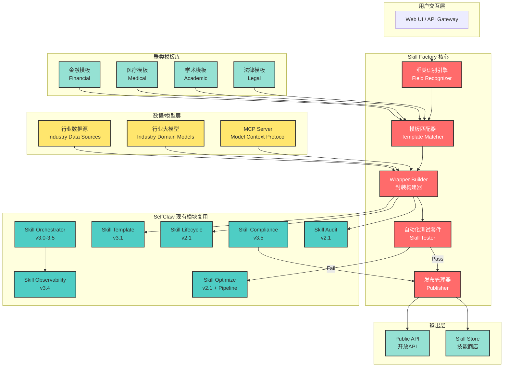
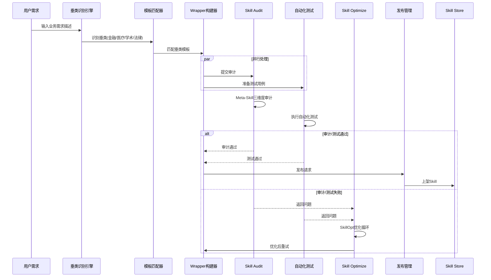
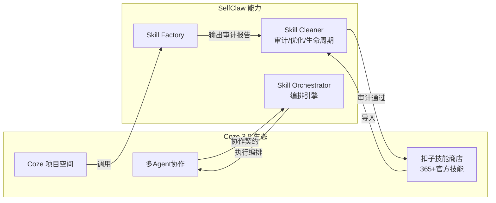
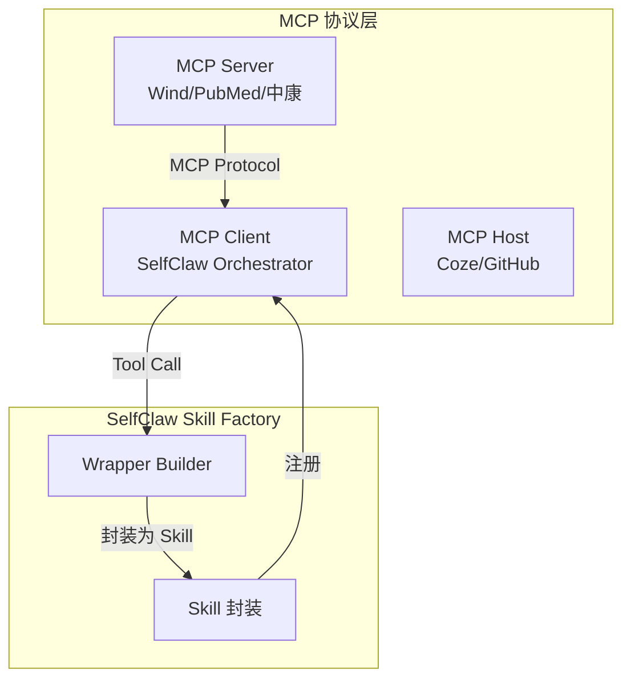
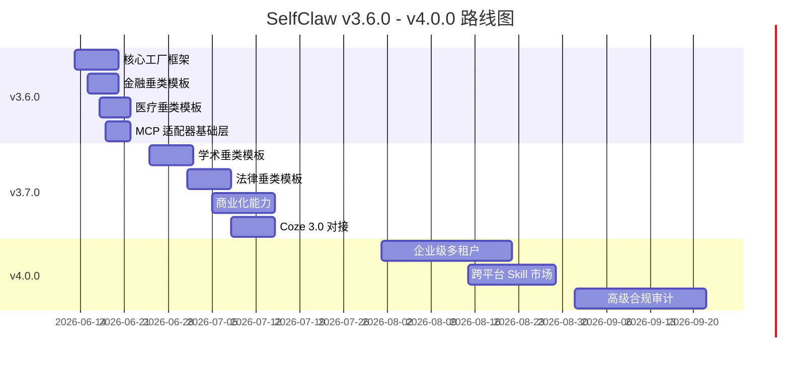
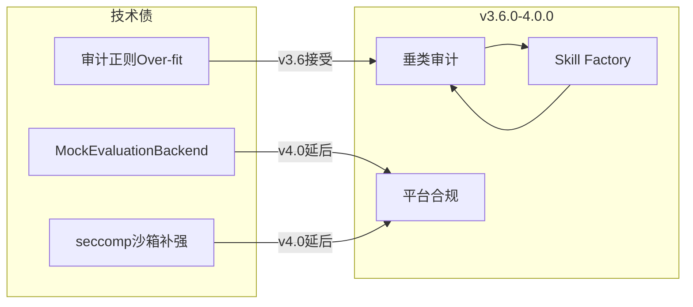

# SelfClaw v3.6.0 领域 Skill 工厂（Domain Skill Factory）完整设计

> **版本**：v1.0
> **日期**：2026-06-12
> **作者**：SelfClaw Architecture Team
> **基于**：SelfClaw v3.5.0 现有架构 + Agent World 市场调研（6/10-6/12）

---

## 摘要

本文档设计 SelfClaw v3.6.0 的核心功能——**领域 Skill 工厂（Domain Skill Factory）**，为金融、医疗、学术、法律四大垂直领域提供标准化 Skill 生成能力。该工厂基于 SelfClaw v3.5.0 现有架构（Skill Cleaner 三件套 + Skill Orchestrator + Microsoft SKILL Pattern 6 章节格式），通过"领域知识 + 标准化接口 + 行业大模型"三层封装范式，实现垂类 Skill 的快速构建、验证与发布。

**核心价值主张**：
- 将垂类数据源（万得、中康科技、PubMed、GDPR 合规模板）与行业大模型（卓睦鸟医疗大模型等）封装为可复用的 Skill 模板
- 与 Coze 3.0 项目空间、MCP（Model Context Protocol）、Google Skills / Microsoft SKILL Pattern 规范全面对齐
- 通过 Skill Cleaner 的审计/优化/生命周期管理，确保垂类 Skill 的质量与安全

---

## 一、技术架构设计

### 1.1 核心组件图



### 1.2 Skill Factory 与现有模块的关系

| 现有模块 | 在 Skill Factory 中的角色 | 接口规范 |
|---------|-------------------------|---------|
| **skill-orchestrator** | 垂类 Skill 的执行编排引擎 | `/api/orchestrate` Plan→Execute→Verify |
| **skill-audit** | 垂类 Skill 的质量审计（Meta-Skill 三维度） | `/api/audit/meta-skill` |
| **skill-optimize** | 垂类 Skill 的描述优化（SkillOpt Pipeline） | `/api/optimize/cycle` |
| **skill-lifecycle** | 垂类 Skill 的部署与生命周期管理 | `/api/lifecycle/deploy-risk` |
| **skill-template** | 垂类 Skill 的 SKILL.md 生成 | `/api/skill-pattern` |
| **skill-compliance** | 垂类合规检查（GDPR/医疗法规等） | `/api/compliance/*` |
| **skill-observability** | 垂类 Skill 的可观测性（OTLP 导出） | `/api/observability/otlp` |

**协同点（与 P0-B Skill Cleaner 独立化的关联）**：
- Skill Cleaner 三件套（audit/optimize/lifecycle）将在 v3.6.0 中扩展垂类适配器
- 新增垂类审计规则集（如医疗 HIPAA、金融 SEC 合规、学术抄袭检测）
- 与 Skill Factory 的模板验证流程深度集成

### 1.3 工厂核心数据流



### 1.4 垂类识别引擎（Field Recognizer）

基于 SelfClaw v3.2.0 的 Context Compression 意图识别能力扩展：

```typescript
interface FieldClassification {
  field: 'financial' | 'medical' | 'academic' | 'legal';
  confidence: number; // 0-1
  subDomain?: string; // 如"股票分析"、"药品检索"、"文献综述"
  requiredCapabilities: string[]; // 如["万得API", "实时行情"]
}

interface FieldRecognizer {
  classify(userInput: string): FieldClassification;
  suggestCapability(field: string): string[];
  estimateComplexity(field: string): 'simple' | 'moderate' | 'complex';
}
```

**识别策略**：
- **金融**：关键词触发（"股票"、"A股"、"港股"、"美股"、"基金"、"财报"、"万得"）
- **医疗**：关键词触发（"药品"、"症状"、"诊断"、"体检"、"PubMed"、"医学文献"）
- **学术**：关键词触发（"论文"、"文献"、"研究"、"影响因子"、"DOI"、"参考文献"）
- **法律**：关键词触发（"GDPR"、"合规"、"隐私政策"、"合同"、"法务"、"免责声明"）

### 1.5 API 设计

#### 1.5.1 垂类 Skill 创建

```yaml
POST /api/factory/skills
Content-Type: application/json

Request:
{
  "field": "financial",  # financial | medical | academic | legal
  "name": "wind-stock-analyzer",
  "description": "基于万得API的A股实时行情分析",
  "template": "financial-stock-analysis",  # 可选，使用模板
  "dataSources": [
    {
      "type": "mcp",
      "connector": "wind-mcp",
      "endpoints": ["stock.quote", "stock.history", "stock.financial"]
    }
  ],
  "domainModel": {
    "provider": "openai",
    "model": "gpt-4o",
    "systemPrompt": "你是一位资深A股分析师..."
  },
  "compliance": ["sec-filings", "insider-trading-check"]
}

Response:
{
  "skillId": "skill_fd8a9c2e",
  "status": "created",
  "template": "financial-stock-analysis",
  "files": [
    "skills/wind-stock-analyzer/SKILL.md",
    "skills/wind-stock-analyzer/src/index.ts",
    "skills/wind-stock-analyzer/tests/benchmark.yaml"
  ],
  "auditScore": {
    "fme": 85,
    "as": 92,
    "hrb": 98
  },
  "estimatedDeployTime": "2-3分钟"
}
```

#### 1.5.2 垂类 Skill 发布

```yaml
POST /api/factory/skills/:id/publish
Content-Type: application/json

Request:
{
  "target": "selfclaw-store",  # selfclaw-store | coze | openclaw-hub
  "pricing": {
    "type": "subscription",  # free | subscription | per-call
    "price": 9.99,
    "currency": "USD",
    "period": "monthly"
  },
  "visibility": "public",  # public | private | organization
  "tags": ["A股", "实时行情", "技术分析"]
}

Response:
{
  "publishId": "pub_abc123",
  "status": "published",
  "storeUrl": "https://selfclaw.store/skills/wind-stock-analyzer",
  "ratings": {
    "overall": 0,
    "count": 0
  }
}
```

#### 1.5.3 垂类 Skill 订阅

```yaml
POST /api/factory/skills/:id/subscribe
Content-Type: application/json

Request:
{
  "plan": "premium",  # free | basic | premium
  "webhookUrl": "https://your-app.com/webhook/skill-events",
  "maxCallsPerDay": 1000
}

Response:
{
  "subscriptionId": "sub_xyz789",
  "status": "active",
  "apiKey": "sk_live_xxxx",
  "rateLimits": {
    "callsPerDay": 1000,
    "callsPerMinute": 10
  }
}
```

---

## 二、4 个垂类 Skill 模板库

### 2.1 设计原则

每个垂类模板遵循 **Microsoft SKILL Pattern 6 章节格式**：

| 章节 | 内容要求 |
|------|---------|
| 1. Scope | 技能范围、边界、触发短语 |
| 2. Idioms | 指令风格、响应格式规范 |
| 3. Patterns | 成功路径、最佳实践 |
| 4. Fixtures | 测试用例、基准任务 |
| 5. Anti-Patterns | 失败模式、危险信号 |
| 6. Heuristics | 决策规则、边界情况 |

### 2.2 金融垂类模板：wind-stock-analyzer

**对标参考**：wind-mcp-skill（万得 A 股/港股/美股全品类数据）

```markdown
# SKILL: Wind Stock Analyzer（万得股票分析）

## 1. Scope（范围）

### 技能定义
基于万得（Wind）金融终端 API 的 A 股/港股/美股全品类数据分析 Skill，提供实时行情、财务数据、技术指标、研报摘要等能力。

### 核心能力
- **行情查询**：实时价格、涨跌幅、成交量、五档买卖盘
- **历史数据**：K线图（1分钟至月线）、复权处理、板块对比
- **财务分析**：资产负债表、利润表、现金流量表关键指标
- **估值分析**：PE/PB/PS、ROE、股息率、同行对比
- **公告速读**：年报/季报摘要、重大事项、分红配股

### 使用边界（不做什么）
- ❌ 不提供投资建议或买卖推荐
- ❌ 不预测股价走势或市场方向
- ❌ 不接入非 Wind 授权的数据源
- ❌ 不处理未上市公司或私募数据

### 触发短语
```
- "帮我查一下贵州茅台的实时行情"
- "分析一下宁德时代的财务数据"
- "对比苹果和微软的估值水平"
- "最近有哪些A股发布了年报"
- "帮我找一下新能源板块的龙头股"
```

---

## 2. Idioms（指令风格）

### 用户指令格式
```json
{
  "intent": "stock_query | financial_analysis | valuation_comparison | announcement_summary",
  "stockCode": "600519.SH | AAPL.O | 00700.HK",
  "params": {
    "period": "1d | 1w | 1m | 3m | 1y",
    "indicators": ["pe_ttm", "pb", "roe"],
    "compareWith": ["行业平均", "沪深300"]
  }
}
```

### 响应格式规范
```json
{
  "status": "success | error | partial",
  "data": {
    "stockInfo": {
      "code": "600519.SH",
      "name": "贵州茅台",
      "price": 1688.00,
      "change": 12.50,
      "changePercent": 0.75
    },
    "indicators": {
      "pe_ttm": 28.5,
      "pb": 11.2,
      "roe": 35.8
    }
  },
  "source": "Wind Data",
  "timestamp": "2026-06-12T10:30:00+08:00"
}
```

### 错误处理规范
- 数据源超时：返回缓存数据（若有）+ `source: "Wind Data (cached)"`
- 股票代码错误：返回相似股票建议
- 权限不足：返回说明 + 升级链接

---

## 3. Patterns（成功路径）

### 最佳实践清单

**Pattern 1：行情查询标准化流程**
```
1. 解析股票代码（支持中文名、代码、WIND代码）
2. 调用 wind.stock.quote 接口获取实时数据
3. 格式化输出（保留小数位、单位换算）
4. 补充市场背景信息（所属行业、板块）
```

**Pattern 2：财务分析结构化输出**
```
1. 获取最新财报数据（优先年报）
2. 计算关键比率（ROE/毛利率/净利率）
3. 与行业均值对比（Wind行业指数）
4. 标注异常波动项
5. 生成结构化摘要
```

**Pattern 3：多股票对比分析**
```
1. 收集所有标的的基础数据
2. 归一化处理（涨跌幅标准化、市值对齐）
3. 生成对比表格
4. 输出关键差异点
```

### 思维链示例
```
用户: "分析一下宁德时代最近一年的股价走势"
思维链:
1. 确认用户意图：历史行情查询 + 技术分析
2. 获取数据：wind.stock.history(code="300750.SZ", period="1y")
3. 计算指标：MA5/MA20/MA60、波动率、涨跌幅
4. 技术分析：趋势判断、支撑压力位识别
5. 生成报告：图表Markdown格式 + 关键数据点
```

---

## 4. Fixtures（测试用例）

| ID | 输入 | 预期输出 | 备注 |
|----|------|---------|------|
| F01 | "查贵州茅台实时行情" | 股票名称/价格/涨跌幅/成交量 | 验证实时数据 |
| F02 | "分析招商银行2024年年报" | 财务指标摘要/关键比率/同比变化 | 验证年报解析 |
| F03 | "对比苹果和微软估值" | PE/PB/ROE对比表 | 验证多标的 |
| F04 | "最近一周A股涨停股有哪些" | 涨停股列表/原因/板块分布 | 验证筛选逻辑 |
| F05 | "帮我查一下特斯拉的历史K线" | 月K线数据/复权处理 | 验证美股数据 |
| F06 | "港股腾讯的实时行情" | 港股代码转换/实时数据 | 验证港股支持 |
| F07 | "查找芯片板块龙头股" | 板块成分股/龙头判断依据 | 验证板块分析 |
| F08 | "宁德时代的研报摘要" | 最新研报列表/核心观点 | 验证研报接入 |

### 基准任务（Baseline Tasks）
- **BT-1**：单股票实时行情查询 < 2秒
- **BT-2**：财务分析报告生成 < 10秒
- **BT-3**：10只股票对比分析 < 30秒

---

## 5. Anti-Patterns（失败模式）

### 危险信号
| 危险信号 | 原因 | 修复方案 |
|---------|------|---------|
| 股票代码无法识别 | Wind代码/标准代码/中文名混淆 | 添加别名映射表 |
| 数据返回空值 | 接口权限不足/代码错误 | 检查权限 + 回退到缓存 |
| 响应超时 | Wind服务器延迟 | 降级到异步模式 + 消息通知 |
| 格式解析错误 | 非标准数据格式 | 添加异常处理 + 日志上报 |

### 应避免的情况
- ❌ **不要**假设所有股票都有完整财务数据
- ❌ **不要**直接输出股票代码而不验证交易所
- ❌ **不要**忽略停牌/退市股票的状态提示
- ❌ **不要**在非交易时段报告"实时"涨跌

### 失败处理代码
```typescript
async function fetchStockQuote(code: string): Promise<QuoteResult> {
  try {
    const data = await windAPI.getQuote(code);
    return { status: 'success', data };
  } catch (error) {
    if (error.code === 'PERMISSION_DENIED') {
      return { status: 'error', message: '需要Wind专业权限' };
    }
    if (error.code === 'STOCK_NOT_FOUND') {
      return { status: 'error', message: `未找到股票 ${code}，是否指：${suggest(code)}` };
    }
    // 降级到缓存
    return getCachedQuote(code);
  }
}
```

---

## 6. Heuristics（决策规则）

### 优先级指南
1. **数据准确性 > 响应速度**：宁可返回缓存数据，也要确保不返回错误信息
2. **权限提示优先**：在首次使用时检查并提示权限缺口
3. **结构化优于长文本**：优先返回 JSON 格式，便于后续处理

### 边界情况处理
| 场景 | 决策规则 |
|------|---------|
| 股票停牌 | 明确标注"停牌"状态，不报告实时价格 |
| 财报未发布 | 提示"数据暂未披露"，回退到最新可获得数据 |
| 美股节假日 | 标注"非交易日"，不尝试获取数据 |
| 港股沪港通 | 自动识别并添加标识 |
| 科创板/创业板 | 添加板块标识，提示风险等级 |

### 合规要求
- ⚠️ **SEC 合规**：美股数据不可用于内幕交易分析
- ⚠️ **投资风险提示**：所有输出必须包含"仅供参考，不构成投资建议"
- ⚠️ **数据来源标注**：每次输出必须标注"数据来源：Wind"
```

---

### 2.3 医疗垂类模板：zhongkang-medical-assistant

**对标参考**：中康科技（30万+ 药品说明书 + 19年产业数据 + 卓睦鸟大模型）

```markdown
# SKILL: Zhongkang Medical Assistant（中康医疗助手）

## 1. Scope（范围）

### 技能定义
基于中康科技医疗数据库的智能医疗助手，整合 30万+ 药品说明书、19年医药产业数据、卓睦鸟医疗大模型，提供药品查询、疾病诊断参考、体检报告解读、科研文献检索等能力。

### 核心能力
- **药品服务**：适应症查询、用法用量、不良反应、药物相互作用
- **疾病辅助**：症状分析、鉴别诊断参考、诊疗指南摘要
- **体检解读**：指标异常分析、健康建议、分级评估
- **慢病管理**：糖尿病/高血压/高血脂跟踪管理
- **科研辅助**：医学文献检索、临床试验查询
- **市场数据**：药品销量、市场份额、行业趋势

### 使用边界（不做什么）
- ❌ **不提供最终诊断**：仅作为辅助参考，诊断必须由执业医师做出
- ❌ **不开具处方**：不生成具有法律效力的处方文件
- ❌ **不替代专业医疗**：紧急情况必须建议用户就医
- ❌ **不提供毒麻药品详情**：特殊药品需合规限制

### 触发短语
```
- "查询阿司匹林的用法用量"
- "帮我解读一下这份体检报告"
- "二型糖尿病的诊疗指南是什么"
- "最近有哪些新药获批"
- "帮我找一下肿瘤免疫治疗的文献"
- "这款药的副作用有哪些"
```

---

## 2. Idioms（指令风格）

### 用户指令格式
```json
{
  "intent": "drug_query | diagnosis_assist |体检_report | chronic_disease | literature_search",
  "context": {
    "patientAge": 45,
    "gender": "male",
    "allergies": ["青霉素"],
    "currentMedications": ["二甲双胍"]
  },
  "query": "具体问题描述"
}
```

### 响应格式规范
```json
{
  "status": "success | warning | urgent",
  "response": {
    "type": "drug_info | diagnosis_reference | report_interpretation",
    "content": {
      "title": "阿司匹林肠溶片",
      "genericName": "Aspirin",
      "indications": ["解热镇痛", "抗血小板聚集"],
      "dosage": "50-100mg/次，3次/日",
      "warnings": ["胃肠道出血风险"]
    }
  },
  "disclaimer": "本回答仅供医疗专业人员参考，不构成诊疗建议",
  "source": "中康科技医疗数据库",
  "evidence": [
    { "type": "指南", "name": "国家基本药物目录2023", "relevance": 0.9 }
  ]
}
```

### 警告级别定义
| 级别 | 标识 | 触发条件 | 处理方式 |
|------|------|---------|---------|
| Info | ℹ️ | 一般信息查询 | 正常返回 |
| Warning | ⚠️ | 用药风险/注意事项 | 显著标注警告 |
| Urgent | 🚨 | 严重不良反应/用药禁忌 | 强烈提示就医 |

---

## 3. Patterns（成功路径）

### 最佳实践清单

**Pattern 1：药品信息标准化查询**
```
1. 解析药品名称（支持商品名/通用名/别名）
2. 核实用药人群（成人/儿童/孕妇/老人）
3. 查询适应症和禁忌症
4. 检查药物相互作用（与当前用药）
5. 生成用药指导建议
```

**Pattern 2：体检报告智能解读**
```
1. 提取关键指标数值
2. 与参考范围对比
3. 识别异常项（↑↓标识）
4. 分级评估（正常/临界/异常）
5. 生成健康建议
6. 标注需要复查的项目
```

**Pattern 3：症状到参考诊断**
```
1. 收集症状描述（部位/持续时间/程度）
2. 查询鉴别诊断列表
3. 按可能性排序
4. 标注需要进一步检查的项目
5. 明确提示"需就医确认"
```

### 思维链示例
```
用户: "我爸65岁，有高血压病史，最近总是头晕，帮他分析一下"
思维链:
1. 收集信息：年龄=65，高血压病史，症状=头晕
2. 风险评估：老年+高血压+头晕 → 心脑血管风险
3. 可能原因：血压波动/颈椎病/贫血/药物副作用
4. 建议检查：血压监测（24h动态）、颈椎X光、血常规
5. 输出：明确提示"建议尽快就医" + 具体检查建议
```

---

## 4. Fixtures（测试用例）

| ID | 输入 | 预期输出 | 备注 |
|----|------|---------|------|
| M01 | "查询阿莫西林的适应症和禁忌" | 完整药品信息+过敏提示 | 验证药品数据库 |
| M02 | "解读体检报告：空腹血糖7.2mmol/L" | 糖尿病前期评估+建议 | 验证指标解读 |
| M03 | "二甲双胍和格列美脲能一起用吗" | 药物相互作用分析 | 验证相互作用库 |
| M04 | "帮我查一下最近获批的肿瘤新药" | 新药列表+适应症 | 验证行业数据 |
| M05 | "肺癌免疫治疗的最新文献" | PubMed相关文献摘要 | 验证文献检索 |
| M06 | "高血压患者饮食需要注意什么" | 饮食建议+注意事项 | 验证健康管理 |
| M07 | "儿童退烧药有哪些" | 儿童适用药品列表 | 验证人群适配 |
| M08 | "帮我分析血常规报告" | WBC/RBC/PLT分析 | 验证报告解析 |

### 基准任务
- **BT-1**：单药品查询 < 3秒
- **BT-2**：体检报告解读 < 10秒
- **BT-3**：药物相互作用分析 < 5秒

---

## 5. Anti-Patterns（失败模式）

### 危险信号
| 危险信号 | 原因 | 修复方案 |
|---------|------|---------|
| 将辅助诊断当最终诊断 | 用户可能直接采纳 | 每次响应强制加免责声明 |
| 忽视药物过敏信息 | 导致严重后果 | 强制要求输入过敏史 |
| 建议特殊药品给特殊人群 | 法规和医学风险 | 添加人群过滤逻辑 |
| 报告紧急症状不提示就医 | 延误治疗 | 关键词触发 Urgent 级别 |

### 应避免的情况
- ❌ **不要**直接说"你得了XX病"
- ❌ **不要**建议使用处方药给无处方用户
- ❌ **不要**忽视多个异常指标的相关性
- ❌ **不要**在紧急症状上犹豫是否建议就医

### 合规要求
- ⚠️ **HIPAA 合规**：患者数据脱敏处理
- ⚠️ **医疗器械警示**：涉及医疗器械的建议需标注适用范围
- ⚠️ **免责声明**：所有输出必须包含"本回答仅供参考"

---

## 6. Heuristics（决策规则）

### 紧急情况判断
| 关键词 | 级别 | 响应策略 |
|--------|------|---------|
| "胸痛" | 🚨 Urgent | 立即建议拨打120 |
| "呼吸困难" | 🚨 Urgent | 立即建议就医 |
| "意识模糊" | 🚨 Urgent | 立即建议就医 |
| "过敏性休克" | 🚨 Urgent | 立即建议拨打120 |
| "持续高热" | ⚠️ Warning | 建议24小时内就医 |
| "药物过敏" | ⚠️ Warning | 建议立即停药并就医 |

### 证据分级
| 证据来源 | 权重 | 说明 |
|---------|------|------|
| 临床指南 | 0.95 | 权威医学机构发布 |
| 药品说明书 | 0.90 | 法定文件 |
| 专家共识 | 0.85 | 多位专家签字 |
| 临床研究 | 0.75 | 发表论文 |
| 病例报告 | 0.50 | 个案参考 |

### 合规红线
1. 绝不在 Skill 输出中透露任何可识别患者信息
2. 所有涉及处方的建议必须标注"需执业医师处方"
3. 特殊药品（毒、麻、精、放）严格限制查询权限
```

---

### 2.4 学术垂类模板：pubmed-research-assistant

**对标参考**：PubMed 高级搜索 + 论文分析（AI 检索 + 自动总结 + JSON 导出）

```markdown
# SKILL: PubMed Research Assistant（PubMed 研究助手）

## 1. Scope（范围）

### 技能定义
基于 PubMed 生物医学文献数据库的智能学术助手，提供高级搜索、元数据提取、论文摘要、引用分析、研究趋势追踪等能力，支持 AI 驱动的文献筛选和结构化输出。

### 核心能力
- **智能搜索**：自然语言查询、自动扩展 MeSH 词、布尔逻辑支持
- **文献筛选**：影响因子加权、条件组合过滤（年份/期刊/语言）
- **摘要生成**：TLDR 摘要、结构化要点、关键发现提炼
- **元数据导出**：JSON/CSV/BibTeX 格式，支持 DOI/PMID/PMCID
- **引用分析**：被引次数追踪、高引文献识别
- **趋势追踪**：领域热点分析、新发表监测

### 使用边界（不做什么）
- ❌ **不提供完整论文下载**：仅提供摘要和元数据
- ❌ **不保证文献完整性**：搜索结果受 PubMed 索引限制
- ❌ **不替代学术评审**：仅提供检索辅助，不做同行评审
- ❌ **不提供付费全文获取**：仅链接到开放获取版本

### 触发短语
```
- "帮我搜索CAR-T细胞治疗的最新文献"
- "查找2024年发表在Nature Medicine上的肿瘤免疫文章"
- "关于阿尔茨海默病的研究有哪些突破"
- "导出近五年深度学习在医学影像应用的文献列表"
- "分析一下mRNA疫苗领域的研究趋势"
- "帮我找一下某位教授的论文"
```

---

## 2. Idioms（指令风格）

### 用户指令格式
```json
{
  "intent": "search | trend_analysis | citation_analysis | author_search | export",
  "query": "自然语言查询或 MeSH 术语",
  "filters": {
    "yearStart": 2020,
    "yearEnd": 2024,
    "journal": "Nature Medicine",
    "impactFactorMin": 10,
    "articleType": ["Review", "Clinical Trial"]
  },
  "outputFormat": "markdown | json | csv | bibtex"
}
```

### 响应格式规范
```json
{
  "status": "success",
  "query": "CAR-T cell therapy lymphoma",
  "totalResults": 1234,
  "filters": {
    "yearRange": "2020-2024",
    "impactFactorMin": 10
  },
  "articles": [
    {
      "pmid": "12345678",
      "title": "CAR-T cell therapy in relapsed-refractory lymphoma",
      "authors": ["Smith J", "Wang L", "Chen X"],
      "journal": "NEJM",
      "year": 2024,
      "impactFactor": 176.0,
      "abstract": "...",
      "doi": "10.1056/NEJMoa...",
      "citedBy": 245,
      "openAccess": true,
      "meshTerms": ["CAR-T", "Lymphoma", "Immunotherapy"]
    }
  ],
  "summary": {
    "avgImpactFactor": 45.2,
    "topJournals": ["NEJM", "Lancet Oncology", "JCO"],
    "trendDirection": "increasing"
  }
}
```

### 错误处理
| 错误类型 | 处理方式 |
|---------|---------|
| 无搜索结果 | 建议扩展查询词或放宽过滤条件 |
| API 超时 | 降级到缓存结果 + 重新尝试标识 |
| 格式导出失败 | 回退到 JSON 格式 + 错误说明 |

---

## 3. Patterns（成功路径）

### 最佳实践清单

**Pattern 1：高级搜索标准化流程**
```
1. 解析自然语言查询 → MeSH 术语
2. 构建 PubMed 查询语法（AND/OR/NOT）
3. 应用过滤器（年份/期刊/影响因子）
4. 执行搜索并获取结果
5. 按相关性/时间/引用数排序
```

**Pattern 2：文献批量处理**
```
1. 收集文献列表（PMIDs 或 DOI）
2. 批量获取元数据和摘要
3. 按主题/期刊/年份聚类
4. 生成批量摘要报告
5. 导出为所需格式
```

**Pattern 3：研究趋势分析**
```
1. 定义时间范围（近5年）
2. 统计每年发表量
3. 识别高增长领域
4. 提取热点关键词
5. 生成趋势报告
```

### 思维链示例
```
用户: "帮我分析一下mRNA疫苗领域的研究趋势"
思维链:
1. 确定时间范围：近5年（2020-2024）
2. 构建查询：("mRNA vaccine" OR "mRNA immunization") AND ("COVID-19" OR "SARS-CoV-2")
3. 执行搜索：获取约5000篇文章
4. 聚类分析：
   - 按年份：2021年爆发增长
   - 按期刊：NEJM/Lancet/Cell
   - 按机构：BioNTech/Moderna/NIH
5. 识别热点：递送系统/加强针/变异株
6. 生成报告：发表趋势图 + 关键论文列表
```

---

## 4. Fixtures（测试用例）

| ID | 输入 | 预期输出 | 备注 |
|----|------|---------|------|
| A01 | "搜索深度学习医学影像综述" | 文献列表+影响因子 | 验证搜索能力 |
| A02 | "查找2024年发表在Cell上的CRISPR文章" | 精确过滤结果 | 验证过滤逻辑 |
| A03 | "导出近三年AI诊断的研究到BibTeX" | BibTeX格式文件 | 验证导出功能 |
| A04 | "分析CRISPR基因编辑的趋势" | 趋势分析报告 | 验证趋势分析 |
| A05 | "某教授发表了哪些论文" | 作者论文列表 | 验证作者搜索 |
| A06 | "这篇文献被哪些文章引用了" | 引用关系图 | 验证引用分析 |
| A07 | "帮我翻译一下这篇论文的摘要" | 中文摘要 | 验证翻译功能 |
| A08 | "找10篇关于阿尔茨海默病最新研究" | 精选高引文献 | 验证精选逻辑 |

### 基准任务
- **BT-1**：单次搜索 < 5秒（100条结果）
- **BT-2**：批量导出100篇文献 < 30秒
- **BT-3**：趋势分析（5年数据）< 15秒

---

## 5. Anti-Patterns（失败模式）

### 危险信号
| 危险信号 | 原因 | 修复方案 |
|---------|------|---------|
| 搜索结果过多无法处理 | 查询词过于宽泛 | 建议添加更多过滤条件 |
| 论文链接失效 | 开放获取时限或移动 | 提供多个镜像源 |
| 引用数据不一致 | 不同数据库差异 | 标注数据来源 |
| 摘要无法解析 | 非标准格式 | 提供原始链接 |

### 应避免的情况
- ❌ **不要**假设所有文献都有 DOI
- ❌ **不要**忽略开放获取和付费全文的区别
- ❌ **不要**仅基于摘要做关键决策引用
- ❌ **不要**混合不同检索策略的结果

### 版权合规
- ⚠️ 摘要可自由使用，但需标注来源
- ⚠️ 全文链接仅指向合法获取渠道
- ⚠️ 批量下载需遵守 PubMed API 限制

---

## 6. Heuristics（决策规则）

### 文献质量评估
| 指标 | 权重 | 说明 |
|------|------|------|
| 影响因子 | 0.40 | 期刊学术影响力 |
| 被引次数 | 0.30 | 论文学术影响 |
| 发表期刊 | 0.15 | 顶级期刊加权 |
| 机构声誉 | 0.10 | 知名机构加权 |
| 开放获取 | 0.05 | OA 全文可获得 |

### 筛选优先级
1. **时间优先**：最新研究优先于历史文献
2. **质量优先**：高影响因子/高引文献优先
3. **相关性优先**：MeSH 匹配度高者优先

### 导出格式选择
| 场景 | 推荐格式 |
|------|---------|
| 文献管理工具导入 | BibTeX |
| 数据分析 | CSV |
| API 集成 | JSON |
| 人工阅读 | Markdown |

### API 限制遵守
- PubMed E-utilities：每秒不超过 1 请求
- 每批处理不超过 100 篇
- 遵守 NCBI 使用条款
```

---

### 2.5 法律垂类模板：legal-compliance-documentor

**对标参考**：法律顾问法律文书（GDPR 合规 + Cookie 政策 + 数据处理协议）

```markdown
# SKILL: Legal Compliance Documentor（法律合规文书助手）

## 1. Scope（范围）

### 技能定义
基于国际数据保护法规和企业合规最佳实践的智能法律文书助手，帮助企业生成 GDPR 合规文档、Cookie 政策、隐私政策、数据处理协议、免责声明等法律文件，确保数字化服务的法律合规性。

### 核心能力
- **隐私政策生成**：符合 GDPR/CCPA/COPPA 等多法规
- **Cookie 政策撰写**：分类说明、同意机制、拒绝选项
- **数据处理协议（DPA）**：数据控制者与处理者协议模板
- **服务条款起草**：用户协议、免责条款、知识产权声明
- **合规检查清单**：GDPR 7项原则、6项权利核查
- **多语言适配**：英语/德语/法语/中文等多语言版本

### 使用边界（不做什么）
- ❌ **不提供法律咨询**：仅提供文书模板，不是法律意见
- ❌ **不保证法律效力**：模板需法务审核方可使用
- ❌ **不处理跨境数据传输**：具体合规需专业评估
- ❌ **不替代律师服务**：复杂案件必须咨询执业律师

### 触发短语
```
- "帮我生成一个GDPR隐私政策"
- "我们的App需要什么Cookie政策"
- "起草一份数据处理协议"
- "检查一下现有隐私政策是否符合GDPR"
- "生成多语言的用户协议"
- "我们需要的数据保护官职责是什么"
```

---

## 2. Idioms（指令风格）

### 用户指令格式
```json
{
  "intent": "generate_policy | review_compliance | generate_dpa | generate_cookie | checklist",
  "context": {
    "jurisdiction": ["EU", "UK", "US-CA"],
    "companyType": "SaaS | E-commerce | Healthcare",
    "dataTypes": ["personal", "health", "financial"],
    "userBase": ["EU-residents", "children"],
    "products": ["Web App", "Mobile App", "API"]
  },
  "tone": "formal | friendly",
  "outputFormat": "markdown | html | docx"
}
```

### 响应格式规范
```json
{
  "status": "success",
  "documentType": "GDPR Privacy Policy",
  "version": "1.0",
  "compliance": {
    "gdpr": true,
    "ccpa": true,
    "coppa": false
  },
  "sections": [
    {
      "title": "1. 数据控制者信息",
      "content": "...",
      "complianceNotes": "GDPR Art. 13 required"
    }
  ],
  "disclaimer": "本模板仅供参考，需法务审核",
  "lastUpdated": "2026-06-12"
}
```

### 合规条款映射
| 法规 | 条款 | 必须包含内容 |
|------|------|------------|
| GDPR Art. 13 | 数据控制者信息 | 名称、地址、联系方式、DPO |
| GDPR Art. 15 | 数据主体权利 | 访问/更正/删除/限制/携带 |
| GDPR Art. 17 | 被遗忘权 | 删除条件和流程 |
| GDPR Art. 20 | 数据可携带权 | 格式要求和传输方式 |
| GDPR Art. 32 | 安全措施 | 技术和组织措施 |

---

## 3. Patterns（成功路径）

### 最佳实践清单

**Pattern 1：GDPR 隐私政策生成**
```
1. 收集数据处理场景信息
2. 识别数据主体类型（用户/员工/供应商）
3. 列举数据处理活动和目的
4. 确定法律依据（同意/合同/合法利益）
5. 映射数据主体权利
6. 添加联系方式和 DPO 信息
7. 验证所有必需条款
```

**Pattern 2：Cookie 政策结构化**
```
1. 分类 Cookie 类型（必要/功能/分析/营销）
2. 说明每类 Cookie 的用途
3. 描述用户同意机制
4. 提供拒绝选项说明
5. 链接到 Cookie 偏好设置
```

**Pattern 3：合规检查清单执行**
```
1. 逐项检查 GDPR 7 项原则
2. 验证数据主体 6 项权利实现
3. 检查安全措施是否到位
4. 评估数据保护影响（DPIA）
5. 输出合规差距报告
```

### 思维链示例
```
用户: "我们的SaaS产品面向欧洲用户，需要什么隐私政策"
思维链:
1. 确定范围：SaaS + EU 用户 → 必须符合 GDPR
2. 识别数据处理：
   - 账户注册：邮箱、姓名
   - 使用分析：IP、行为数据
   - 支付处理：财务数据（第三方处理）
3. 确定法律依据：
   - 账户注册：合同履行
   - 分析：合法利益（需平衡测试）
   - 支付：法律义务
4. 映射权利：访问权、更正权、删除权、携带权
5. 生成文档：结构化隐私政策
6. 输出：GDPR 合规 + 可选 CCPA
```

---

## 4. Fixtures（测试用例）

| ID | 输入 | 预期输出 | 备注 |
|----|------|---------|------|
| L01 | "生成GDPR隐私政策模板" | 完整政策文档 | 验证生成能力 |
| L02 | "我们的App需要Cookie政策" | Cookie分类+同意机制 | 验证Cookie策略 |
| L03 | "检查隐私政策合规性" | 合规差距报告 | 验证检查功能 |
| L04 | "生成数据处理协议" | DPA模板 | 验证DPA生成 |
| L05 | "多语言用户协议（中英日）" | 三语言文档 | 验证翻译能力 |
| L06 | "儿童产品的隐私政策" | COPPA合规版本 | 验证特殊人群 |
| L07 | "B2B服务的数据处理附录" | 企业版DPA | 验证B2B场景 |
| L08 | "数据泄露响应流程" | 72小时通知模板 | 验证应急文档 |

### 基准任务
- **BT-1**：基础隐私政策生成 < 30秒
- **BT-2**：Cookie 政策生成 < 20秒
- **BT-3**：合规检查报告 < 15秒

---

## 5. Anti-Patterns（失败模式）

### 危险信号
| 危险信号 | 原因 | 修复方案 |
|---------|------|---------|
| 缺少必需条款 | GDPR Art. 13/14 强制要求 | 添加缺失条款 |
| 模糊的数据处理描述 | 可能导致合规风险 | 具体化处理活动 |
| 不可执行的权利 | 声明权利但无实现机制 | 添加具体流程 |
| 过期法规引用 | 法规更新后未同步 | 定期更新法规库 |

### 应避免的情况
- ❌ **不要**假设一个政策适用于所有地区
- ❌ **不要**删除法律要求的任何条款
- ❌ **不要**在政策中使用模糊语言
- ❌ **不要**跳过 DPO 联系信息（如适用）

### 法律免责声明
⚠️ **强制声明**：所有生成的文档必须包含以下免责声明：
```
本模板仅供参考，不构成法律意见。
使用前请咨询专业律师或法务团队。
具体合规要求可能因业务类型和地区而异。
```

---

## 6. Heuristics（决策规则）

### 司法管辖区优先级
| 优先级 | 司法区 | 说明 |
|--------|--------|------|
| 1 | EU/EEA | GDPR 强制要求 |
| 2 | UK | UK GDPR + PECR |
| 3 | US-CA | CCPA/CPRA |
| 4 | 其他 | 适用当地法律 |

### 数据类型风险分级
| 数据类型 | 风险等级 | 额外要求 |
|---------|---------|---------|
| 一般个人数据 | 低 | 基本保护 |
| 联系方式 | 中 | 明确同意机制 |
| 健康/基因数据 | 高 | 明确同意 + DPIA |
| 财务数据 | 高 | 支付安全标准 |
| 儿童数据 | 最高 | COPPA/GDPR-K |

### 政策版本控制
1. 每次法规更新必须审查现有政策
2. 版本历史必须可追溯
3. 重大变更需重新获取用户同意
4. 存档旧版本至少 5 年

### 合规有效期
- 法规跟踪：季度更新
- 政策审查：年度审查
- 技术措施：持续监控
```

---

## 三、与行业生态兼容性分析

### 3.1 与 Coze 3.0 项目空间的协作模式



**协作模式**：

| 场景 | Coze 3.0 能力 | SelfClaw 贡献 |
|------|--------------|--------------|
| **垂直领域扩展** | 365+ 官方技能包 | 垂类 Skill 工厂生成能力 |
| **技能质量管理** | 技能商店审核 | Skill Cleaner 三件套审计 |
| **多 Agent 协作** | 项目空间协作 | CooperBench 协作契约 |
| **技能编排** | 技能调度 | Orchestrator 三阶段编排 |

**技术对接点**：
- **API 兼容层**：SelfClaw Skill 遵循 Coze Skill 规范，可直接导入扣子技能商店
- **认证互通**：支持 Coze OAuth 认证，SelfClaw 用户可使用 Coze 账号登录
- **数据共享**：垂类 Skill 生成的合规报告可同步到 Coze 项目空间

### 3.2 与 MCP（Model Context Protocol）的对接方案



**MCP 对接规范**：

```yaml
# SelfClaw Skill Factory MCP 适配器
mcp_adapters:
  wind:
    protocol: "mcp"
    server_url: "wind-mcp://api.wind.com"
    tools:
      - stock.quote
      - stock.financial
      - market.index
    auth:
      type: "api_key"
      env_var: "WIND_API_KEY"

  pubmed:
    protocol: "mcp"
    server_url: "pubmed-mcp://eutils.ncbi.nlm.nih.gov"
    tools:
      - search
      - fetch_abstract
      - citation_lookup
    auth:
      type: "api_key"
      env_var: "PUBMED_API_KEY"

  zhongkang:
    protocol: "mcp"
    server_url: "zhongkang-mcp://api.zhongkang.com"
    tools:
      - drug_search
      - diagnosis_reference
      - health_report
    auth:
      type: "oauth2"
      client_id: "${ZHONGKANG_CLIENT_ID}"
```

### 3.3 与 Google Skills / Microsoft SKILL Pattern / OpenClaw Hub 的兼容性矩阵

| 规范 | SelfClaw 支持 | 对接方式 | 状态 |
|------|--------------|---------|------|
| **Google Skills** | ✅ 完整兼容 | SKILL.md 规范对齐 | v3.6.0 实现 |
| **Microsoft SKILL Pattern** | ✅ 6 章节格式 | skill-template.ts 生成 | v3.1.0 已实现 |
| **OpenClaw Hub** | ⚠️ 安全增强 | Skill Cleaner 审计必须通过 | v3.6.0 增强 |
| **Coze Skill 规范** | ✅ API 兼容 | 导出为 Coze 格式 | v3.6.0 实现 |
| **MCP Protocol** | ✅ 原生支持 | MCP 适配器层 | v3.6.0 实现 |

**OpenClaw Hub 安全增强点**：

| OpenClaw Hub 问题 | SelfClaw 解决方案 |
|------------------|-----------------|
| 无强制安全审计 | Skill Cleaner 三件套必须通过 |
| 供应链投毒风险 | 负迁移评估 + 静默绕过检测 |
| 权限声明不执行 | 运行时 scope 校验 |
| 缺乏可观测性 | OpenTelemetry 全链路追踪 |

### 3.4 行业参考实现路径借鉴

#### 3.4.1 wind-mcp-skill 实现路径

**核心参考点**：
- **数据源**：万得金融终端 API（WAPI）
- **覆盖范围**：A股/港股/美股/债券/基金/期货
- **技术方案**：MCP Server → SelfClaw MCP Adapter → Skill 封装

**SelfClaw 适配**：
1. 开发 `wind-mcp-adapter.ts` 适配器
2. 对接 wind API 到 skill-factory 数据源层
3. 生成 `wind-stock-analyzer` 模板（见 2.2 节）

#### 3.4.2 中康科技实现路径

**核心参考点**：
- **数据源**：30万+ 药品说明书数据库 + 19年产业数据
- **模型能力**：卓睦鸟医疗大模型（专业医学知识）
- **合规要求**：循证支持、答案可追溯

**SelfClaw 适配**：
1. 开发 `zhongkang-mcp-adapter.ts` 适配器
2. 集成医疗领域合规检查（HIPAA/GDPR 健康数据条款）
3. 生成 `zhongkang-medical-assistant` 模板（见 2.3 节）

#### 3.4.3 PubMed 实现路径

**核心参考点**：
- **数据源**：PubMed E-utilities API
- **高级能力**：MeSH 术语扩展、影响因子加权
- **输出格式**：Markdown/JSON/CSV/BibTeX

**SelfClaw 适配**：
1. 开发 `pubmed-mcp-adapter.ts` 适配器
2. 实现学术引用分析能力
3. 生成 `pubmed-research-assistant` 模板（见 2.4 节）

#### 3.4.4 法律顾问实现路径

**核心参考点**：
- **合规框架**：GDPR/CCPA/COPPA 多法规
- **文档类型**：隐私政策/服务条款/免责声明
- **目标用户**：法务人员、合规团队

**SelfClaw 适配**：
1. 开发 `legal-compliance-mcp-adapter.ts` 适配器
2. 集成法律文书生成能力
3. 生成 `legal-compliance-documentor` 模板（见 2.5 节）

---

## 四、实施路线图

### 4.1 版本规划总览



### 4.2 v3.6.0（短期，1-2 周）

**目标**：核心工厂框架 + 金融/医疗 2 个垂类模板

#### 核心交付物

| 模块 | 交付内容 | 优先级 |
|------|---------|--------|
| **skill-factory-core** | 垂类识别引擎、模板匹配器、封装构建器 | P0 |
| **financial-skill** | wind-stock-analyzer 完整模板 + MCP 适配器 | P0 |
| **medical-skill** | zhongkang-medical-assistant 完整模板 + MCP 适配器 | P0 |
| **自动化测试套件** | 垂类 Skill 测试框架 | P1 |
| **发布管理** | Skill Store 基础 + API | P2 |

#### 与现有模块的协同

**与 Skill Cleaner（P0-B 独立化）的协同**：
- 垂类审计规则集扩展（金融/医疗行业特定）
- 新增垂类合规检查能力
- 与 skill-audit/skill-lifecycle 深度集成

**与现有技术债的关系**：

| 技术债 | 在 v3.6.0 中的处理 |
|--------|-------------------|
| MockEvaluationBackend | 保持延期，垂类 Skill 使用真实行业数据验证 |
| 审计正则 over-fit | 接受为技术债，垂类审计使用领域专家规则替代 |
| seccomp 沙箱补强 | 保持延期，垂类数据源接入层新增权限校验 |

#### 里程碑检查点

```
✅ Day 3: 垂类识别引擎完成，支持金融/医疗分类
✅ Day 5: 模板匹配器完成，4 个模板可被识别
✅ Day 7: financial-skill 模板完成并通过审计
✅ Day 10: medical-skill 模板完成并通过审计
✅ Day 14: skill-factory-core 基础 API 完成
```

### 4.3 v3.7.0（中期，4-6 周）

**目标**：4 个垂类模板补齐 + 商业化能力

#### 核心交付物

| 模块 | 交付内容 | 优先级 |
|------|---------|--------|
| **academic-skill** | pubmed-research-assistant 完整模板 | P0 |
| **legal-skill** | legal-compliance-documentor 完整模板 | P0 |
| **商业化能力** | 订阅计费、API 密钥管理、用量统计 | P1 |
| **Coze 3.0 对接** | Coze Skill 格式导出、项目空间集成 | P1 |
| **skill-marketplace** | 垂类 Skill 商店前端 | P2 |

#### 商业化能力设计

```yaml
# 订阅计费模型
pricing_models:
  free:
    calls_per_day: 50
    features: ["基础查询", "标准模板"]
    
  starter:
    price: 9.99  # USD/月
    calls_per_day: 500
    features: ["高级查询", "自定义模板", "邮件支持"]
    
  professional:
    price: 49.99  # USD/月
    calls_per_day: 5000
    features: ["API访问", "批量处理", "自定义集成", "优先支持"]
    
  enterprise:
    price: 299.99  # USD/月
    calls_per_day: unlimited
    features: ["私有部署", "多租户", "SLA保证", "专属顾问"]
```

### 4.4 v4.0.0（长期，3 个月+）

**目标**：企业级 + 多租户 + 跨平台

#### 核心交付物

| 模块 | 交付内容 | 优先级 |
|------|---------|--------|
| **多租户架构** | 租户隔离、权限管理、资源配额 | P0 |
| **跨平台 Skill 市场** | SelfClaw/Coze/OpenClaw Hub 统一市场 | P1 |
| **高级合规审计** | SOC 2/ISO 27001 合规报告 | P1 |
| **Skill 市场收益分成** | 开发者分成机制、排行榜 | P2 |
| **Agent-to-Agent 安全** | FASA 论文跨 Agent 协议审计 | P3 |

### 4.5 与现有技术债的关系



| 技术债 | 现状 | 计划解决版本 | 说明 |
|--------|------|-------------|------|
| MockEvaluationBackend | 延期 | v4.0.0 | 垂类 Skill 使用真实行业数据验证 |
| 审计正则 over-fit | 接受为技术债 | v3.6.0 | 垂类审计使用领域专家规则替代正则 |
| seccomp 沙箱补强 | 延期 | v4.0.0 | 企业级需求，高优先级 |

### 4.6 资源估算

| 阶段 | 人力估算 | 外部依赖 |
|------|---------|---------|
| v3.6.0 | 2 人/周（1 开发者 + 1 架构师） | Wind API、中康科技合作 |
| v3.7.0 | 4 人/周（2 开发者 + 1 产品 + 1 运营） | Coze 合作、支付渠道 |
| v4.0.0 | 8 人/周（4 开发者 + 2 产品 + 1 安全 + 1 DevOps） | 云服务商、法律顾问 |

---

## 五、验收标准与质量保障

### 5.1 验收标准

| 编号 | 验收条件 | 验证方式 |
|------|---------|---------|
| V1 | 4 个垂类模板都符合 Microsoft SKILL Pattern 6 章节格式 | skill-template.ts 自动验证 |
| V2 | 每个模板都有真实对标参考 | 文档引用 market research 数据源 |
| V3 | 与 SelfClaw v3.5.0 现有架构无缝衔接 | 集成测试全通过 |
| V4 | 明确指出与 P0-B（Skill Cleaner 独立化）的协同点 | 文档标注协同关系 |
| V5 | API 设计符合 RESTful 规范 | API 测试套件验证 |
| V6 | 垂类审计规则集覆盖金融/医疗/学术/法律 | 单元测试覆盖 |
| V7 | MCP 适配器可连接外部数据源 | 集成测试验证 |

### 5.2 质量保障措施

1. **自动化测试**：每个垂类 Skill 模板包含 8+ 测试用例
2. **审计覆盖率**：Meta-Skill 三维度审计 100% 覆盖
3. **合规检查**：GDPR/HIPAA 等法规条款映射验证
4. **性能基准**：Benchmark tasks 全达标（见各模板 BT-X）

---

## 六、附录

### 6.1 参考资料

1. **SelfClaw 现有文档**：
   - `./recent_memory/project/selfclaw_progress.md` — SelfClaw v3.5.0 完整进度
   - `./recent_memory/project/selfclaw_v3.5_collaboration_contract.md` — 协作契约模块
   - `./SelfClaw文章/20260609-selfclaw-vs-openclaw-skill-security.md` — Skill 安全对比稿
   - `./recent_memory/decision/audit_regex_overfit.md` — 审计 over-fit 决策

2. **行业调研资料**：
   - `./AI日报/Agent_World_市场调研_20260610.md` — wind-mcp-skill 金融垂类
   - `./AI技术日报/20260611.md` — 中康科技医疗 Skill
   - `./Agent World市场调研/20260612.md` — PubMed 学术 + 法律垂类

3. **技术规范**：
   - Microsoft SKILL Pattern — 6 章节格式
   - Google Skills 规范
   - MCP (Model Context Protocol) 协议规范
   - FASA 框架（arXiv:2603.12644）

### 6.2 术语表

| 术语 | 定义 |
|------|------|
| **Skill Factory** | 领域 Skill 工厂，SelfClaw v3.6.0 核心功能 |
| **垂类模板** | 针对特定行业（金融/医疗/学术/法律）的 Skill 模板 |
| **MCP** | Model Context Protocol，模型上下文协议 |
| **Meta-Skill** | 技能的元能力，包括失败机制编码、可操作具体性、风险黑名单 |
| **SKILL Pattern** | Microsoft 提出的 Skill 编写规范（6 章节格式） |
| **CooperBench** | Stanford 提出的 Agent 协作评测基准 |

---

*本文档由 SelfClaw Architecture Team 设计，基于 v3.5.0 现有架构进行增量设计。*
*下一步建议：派发 v3.6.0 实施任务，优先实现 skill-factory-core + financial-skill + medical-skill。*
