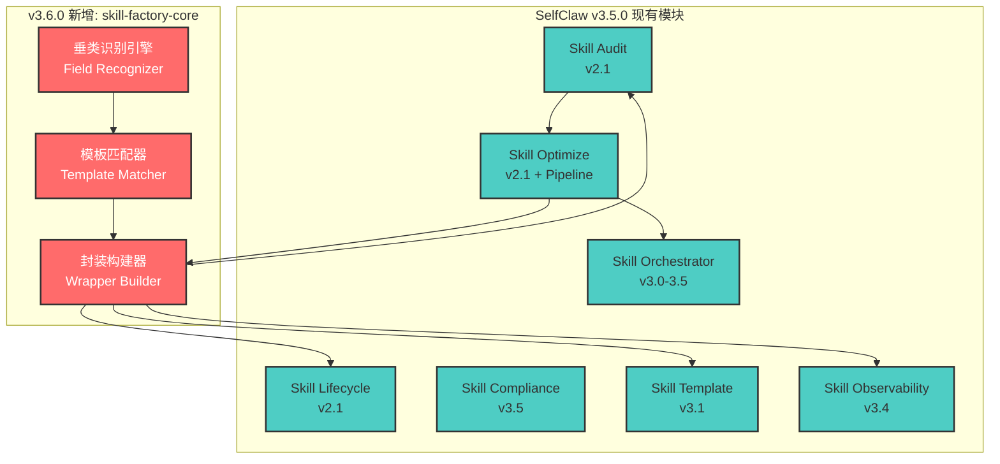
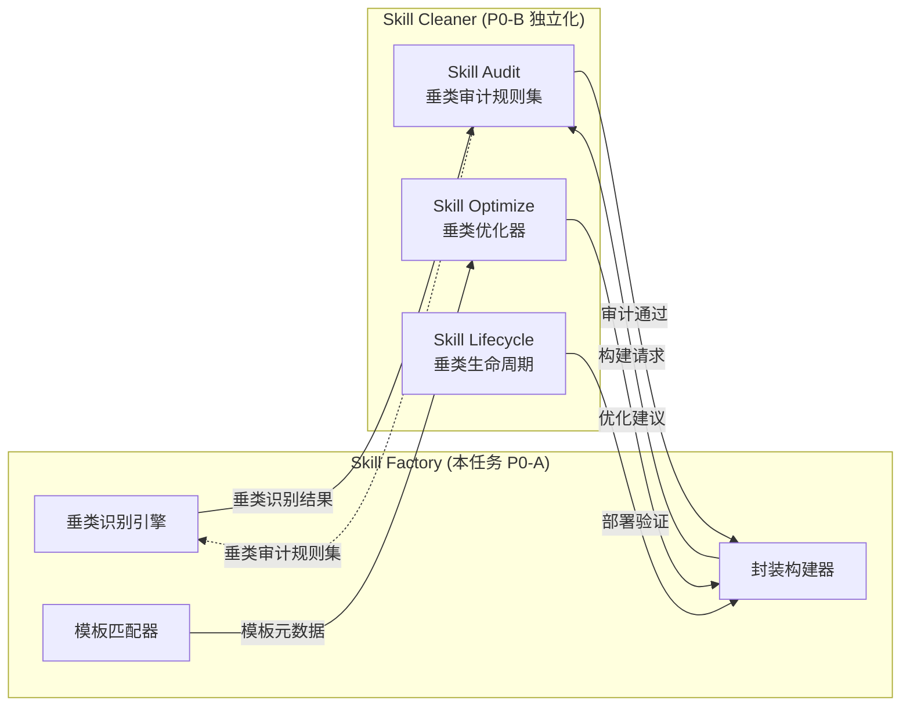
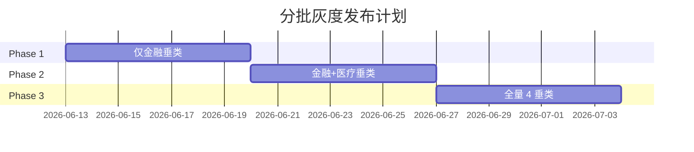

# SelfClaw v3.6.0 实施计划 - skill-factory-core 核心框架

> **版本**：v1.0  
> **日期**：2026-06-12  
> **状态**：规划中，待主人 Review  
> **基于**：P0-A 设计文档（`领域Skill工厂设计.md`）

---

## 一、概述与范围

### 1.1 任务目标

基于 P0-A 设计文档，实施 SelfClaw v3.6.0 的核心框架：**垂类识别引擎 + 模板匹配器 + 封装构建器**。这是领域 Skill 工厂的核心架构组件，为金融、医疗、学术、法律四大垂直领域提供标准化 Skill 生成能力。

### 1.2 交付物清单

| 序号 | 交付物 | 路径 | 规模 |
|------|--------|------|------|
| 1 | 详细实施计划文档 | `./实施计划.md` | ~3,500 字 |
| 2 | TypeScript 核心代码骨架 | `./code/` | ~1,500 行 |
| 3 | 单元测试样例 | `./tests/` | ~600 行 |
| 4 | 集成测试用例 | `./integration-tests/` | ~400 行 |

### 1.3 与现有架构的关系



---

## 二、与现有 7 大模块的集成点

### 2.1 Skill Orchestrator (v3.0-3.5)

**集成方式**：垂类 Skill 的执行编排

| 集成点 | 说明 | 接口 |
|--------|------|------|
| 意图继承 | 垂类 Skill 复用 v3.2.0 的 8 类意图（audit/optimize/deploy/analyze/manage/create/monitor/mixed） | `GoalIntent` 类型 |
| Plan→Execute→Verify | 垂类 Skill 通过 Orchestrator 执行三阶段编排 | `/api/orchestrate` |
| CodeAct Batching | 垂类 Skill 同类任务合并执行 | `codeActBatching` 配置 |

**复用点**：
- `GoalIntent` 类型定义（已在 skill-orchestrator.ts 中定义）
- 意图识别正则（中文正则格式：`审[计查]`、`优[化改进]` 等）

### 2.2 Skill Audit (v2.1)

**集成方式**：垂类 Skill 质量审计

| 集成点 | 说明 | 接口 |
|--------|------|------|
| Meta-Skill 三维度 | 垂类 Skill 继承失败机制编码、可操作具体性、高风险黑名单审计 | `/api/audit/meta-skill` |
| 垂类审计扩展 | 金融（SEC 合规）、医疗（HIPAA）、学术（抄袭检测）、法律（GDPR）特定规则 | 新增 API |

**复用点**：
- `MetaSkillAuditReport` 接口
- `DimensionResult` 类型
- 审计正则扩展（接受 over-fit 为技术债）

### 2.3 Skill Optimize (v2.1 + Pipeline)

**集成方式**：垂类 Skill 描述优化

| 集成点 | 说明 | 接口 |
|--------|------|------|
| SkillOpt Pipeline | 垂类模板描述的 Rollout→Reflect→Edit→Gate 优化循环 | `/api/optimize/cycle` |
| 文本学习率 | 垂类领域词汇的 lr=4 调优 | `LRScheduler` |
| 拒绝编辑缓冲 | 优化过程中被拒绝的编辑记录 | `/api/optimize/rejected-buffer` |

**复用点**：
- `PipelineTrainer` 类
- `LRScheduler` 类
- `PersistentRejectedEditBuffer` 类

### 2.4 Skill Lifecycle (v2.1)

**集成方式**：垂类 Skill 部署与生命周期

| 集成点 | 说明 | 接口 |
|--------|------|------|
| 部署风险评估 | 垂类 Skill 部署前的领域风险评估 | `/api/lifecycle/deploy-risk` |
| 静默绕过检测 | 垂类 Skill 是否绕过合规检查 | `/api/audit/silent-bypass` |
| 技能级记忆 | 垂类特定的成功模式/失败模式记录 | `/api/lifecycle/skill-memory` |

**复用点**：
- `evaluateDeploymentRisk()` 函数
- `detectSilentBypass()` 函数
- `SkillMemory` 接口

### 2.5 Skill Compliance (v3.5)

**集成方式**：垂类合规检查

| 集成点 | 说明 | 接口 |
|--------|------|------|
| IndustryCategory | 行业分类：finance/legal/medical/tech/education | `IndustryCategory` 类型 |
| 行业检测 | 自动识别垂类行业 | `detectIndustry()` |
| 合规检查 | 垂类法规映射（GDPR/HIPAA/SEC） | `/api/compliance/*` |

**复用点**：
- `IndustryCategory` 类型定义
- `detectIndustry()` 函数

### 2.6 Skill Template (v3.1)

**集成方式**：垂类 Skill SKILL.md 生成

| 集成点 | 说明 | 接口 |
|--------|------|------|
| SKILL Pattern 6 章节 | 垂类模板遵循 Scope/Idioms/Patterns/Fixtures/Anti-Patterns/Heuristics | `SKILLPatternFormat` |
| 行业模板生成 | 按垂类生成 SKILL.md + references/ + scripts/ | `generateSKILLPattern()` |
| 批量模板化 | 一键将垂类目录转换为 Coze 3.0 可上架结构 | `wrapAllSkillsForSKILLPattern()` |

**复用点**：
- `SKILLPatternFormat` 接口
- `generateSKILLPattern()` 函数
- `wrapSkillForSKILLPattern()` 函数

### 2.7 Skill Observability (v3.4)

**集成方式**：垂类 Skill 的 OpenTelemetry 可观测性

| 集成点 | 说明 | 接口 |
|--------|------|------|
| Trace 生成 | 垂类识别→模板匹配→封装的完整链路追踪 | `generateOrchestrationTrace()` |
| Spans 结构 | 三层 Span（orchestrator.plan/execute/verify） | `OtelSpan` |
| Metrics 指标 | 垂类识别准确率、模板匹配率、构建成功率 | 13 类 metrics |

**复用点**：
- `OtelSpan` 类型
- `OtelMetric` 类型
- `OrchestrationTrace` 类型

---

## 三、与 P0-B Skill Cleaner 独立化的协同点

### 3.1 协同架构



### 3.2 垂类审计规则集扩展

**新增的垂类审计规则**：

| 垂类 | 审计维度 | 具体规则 |
|------|----------|----------|
| **金融** | SEC 合规 | 是否包含"不构成投资建议"免责声明 |
| **金融** | 风险披露 | 涨跌幅风险、杠杆风险、流动性风险的提示 |
| **医疗** | HIPAA 合规 | 患者数据脱敏、患者信息不透露 |
| **医疗** | 诊断边界 | 明确标注"仅供辅助参考，不构成诊断" |
| **医疗** | 紧急症状 | 胸痛/呼吸困难等症状触发 Urgent 级别 |
| **学术** | 引用规范 | DOI/PMID/PMCID 完整性、参考文献格式 |
| **学术** | 原创性 | 抄袭检测、引用透明度 |
| **法律** | GDPR 合规 | 数据主体权利（Art. 13-22）完整覆盖 |
| **法律** | 免责声明 | "不构成法律意见"强制声明 |

**协同接口**：

```typescript
interface DomainAuditRules {
  field: 'financial' | 'medical' | 'academic' | 'legal';
  requiredChecklist: string[];
  riskLevelThresholds: {
    critical: number;  // >90 分才允许发布
    high: number;      // >75 分才允许发布
    medium: number;    // >60 分才允许发布
  };
  mandatoryDisclaimers: string[];
}
```

### 3.3 协同 API 设计

| API 端点 | 方法 | 说明 | 协同模块 |
|----------|------|------|----------|
| `/api/factory/audit/domain` | POST | 垂类专项审计 | Skill Audit |
| `/api/factory/audit/domain/:field` | GET | 获取垂类审计规则集 | Skill Audit |
| `/api/factory/optimize/domain` | POST | 垂类描述优化 | Skill Optimize |
| `/api/factory/lifecycle/domain-check` | POST | 垂类部署前检查 | Skill Lifecycle |

---

## 四、与 v3.5.0 协作契约模块的复用点

### 4.1 协作契约继承

**复用点**：
- `CollaborationContract` 接口（契约状态机）
- `CommitmentExecution` 接口（承诺执行跟踪）
- `evaluateCollaboration()` 函数（协作分数计算）

**垂类场景示例**：

```typescript
// 金融垂类：多数据源协同
const financialContract = {
  type: "multi-source-coordination",
  parties: ["wind-api", "news-api", "analytics-engine"],
  commitments: [
    { party: "wind-api", promise: "提供实时行情数据", deadline: "5s" },
    { party: "news-api", promise: "提供相关新闻数据", deadline: "10s" },
    { party: "analytics-engine", promise: "综合分析输出报告", deadline: "15s" }
  ]
};

// 医疗垂类：医患协同
const medicalContract = {
  type: "patient-provider-coordination",
  parties: ["doctor-agent", "patient-agent"],
  commitments: [
    { party: "patient-agent", promise: "提供完整病史信息", deadline: "immediate" },
    { party: "doctor-agent", promise: "提供诊断参考意见", deadline: "30s" }
  ]
};
```

### 4.2 违约检测扩展

| 垂类 | 违约类型 | 检测逻辑 |
|------|----------|----------|
| 金融 | 数据源超时 | 行情数据超过 5 秒未返回 |
| 金融 | 数据不一致 | 多个数据源返回值差异 > 5% |
| 医疗 | 药物冲突 | 检测到药物相互作用未警告 |
| 医疗 | 诊断超时 | 紧急症状超过 10 秒未响应 |
| 学术 | 引用缺失 | 关键论点无参考文献支撑 |
| 法律 | 条款缺失 | GDPR 必需条款未包含 |

---

## 五、实施计划（14 天）

### 5.1 每日任务分解

#### Week 1：核心框架 + 垂类识别引擎

| Day | 任务 | 交付物 | 验收标准 |
|-----|------|--------|----------|
| **Day 1** | 环境搭建 + 类型定义 | `types.ts` | TypeScript 编译通过 |
| **Day 2** | 垂类识别引擎基础 | `field-recognizer.ts` | 4 个垂类识别逻辑完成 |
| **Day 3** | 意图识别扩展 | `field-recognizer.ts` | 8 类意图识别 + 中文正则 |
| **Day 4** | 模板匹配器基础 | `template-matcher.ts` | 4 个垂类模板注册表完成 |
| **Day 5** | 匹配算法实现 | `template-matcher.ts` | 基于垂类+意图+数据源的匹配 |
| **Day 6** | 封装构建器基础 | `wrapper-builder.ts` | SKILL.md 6 章节生成 |
| **Day 7** | 领域模型集成 | `wrapper-builder.ts` | 行业大模型 + 数据源封装 |

#### Week 2：测试 + 集成

| Day | 任务 | 交付物 | 验收标准 |
|-----|------|--------|----------|
| **Day 8** | 单元测试 - 垂类识别 | `field-recognizer.test.ts` | 12 个测试用例通过 |
| **Day 9** | 单元测试 - 模板匹配 | `template-matcher.test.ts` | 16 个测试用例通过 |
| **Day 10** | 单元测试 - 封装构建 | `wrapper-builder.test.ts` | 8 个测试用例通过 |
| **Day 11** | 集成测试 - 金融场景 | `financial-scenario.md` | curl 命令 + 预期响应 |
| **Day 12** | 集成测试 - 医疗场景 | `medical-scenario.md` | curl 命令 + 预期响应 |
| **Day 13** | 集成测试 - 学术/法律场景 | `academic-scenario.md`<br/>`legal-scenario.md` | curl 命令 + 预期响应 |
| **Day 14** | 文档完善 + Code Review | 实施计划 + README | 所有文档完整 |

### 5.2 分批灰度策略

参考 v3.5.0 seccomp 沙箱的灰度经验，实施分批灰度发布：



**灰度配置**：

```typescript
interface GrayScaleConfig {
  enabledFields: ('financial' | 'medical' | 'academic' | 'legal')[];
  trafficPercentage: number;
  featureFlags: {
    templateMatching: boolean;
    wrapperBuilder: boolean;
    observability: boolean;
  };
}

// Phase 1: 仅金融
const phase1Config: GrayScaleConfig = {
  enabledFields: ['financial'],
  trafficPercentage: 10,
  featureFlags: { templateMatching: true, wrapperBuilder: true, observability: true }
};

// Phase 2: 金融 + 医疗
const phase2Config: GrayScaleConfig = {
  enabledFields: ['financial', 'medical'],
  trafficPercentage: 30,
  featureFlags: { templateMatching: true, wrapperBuilder: true, observability: true }
};

// Phase 3: 全量
const phase3Config: GrayScaleConfig = {
  enabledFields: ['financial', 'medical', 'academic', 'legal'],
  trafficPercentage: 100,
  featureFlags: { templateMatching: true, wrapperBuilder: true, observability: true }
};
```

---

## 六、风险点与缓解措施

### 6.1 技术风险

| 风险 | 概率 | 影响 | 缓解措施 |
|------|------|------|----------|
| 中文正则边界问题 | 高 | 中 | 使用字符类 `审[计查]` 替代 `\b审[计查]\b` |
| 垂类识别准确率不足 | 中 | 高 | 引入置信度阈值 + 人工兜底 |
| 模板匹配歧义 | 中 | 中 | 多模板候选 + 用户确认机制 |
| MCP 适配器不稳定 | 低 | 高 | 降级到缓存数据 + 异步重试 |

### 6.2 集成风险

| 风险 | 概率 | 影响 | 缓解措施 |
|------|------|------|----------|
| 与现有 Skill Audit 冲突 | 低 | 高 | 新增 `/api/factory/*` 端点隔离 |
| 与 Skill Template 生成冲突 | 低 | 中 | 使用不同文件后缀（.pattern.md） |
| OpenTelemetry trace 膨胀 | 中 | 中 | Ring Buffer 限制 100 条 traces |

### 6.3 业务风险

| 风险 | 概率 | 影响 | 缓解措施 |
|------|------|------|----------|
| 垂类数据源接入延迟 | 高 | 中 | 使用 Mock 数据先行，后续替换 |
| 行业大模型 API 不稳定 | 中 | 高 | 多 provider 降级 + 缓存机制 |

---

## 七、验收标准

### 7.1 功能验收

| 编号 | 验收条件 | 验证方式 |
|------|---------|----------|
| V1 | 垂类识别引擎支持 4 个垂类（金融/医疗/学术/法律）识别 | 单元测试 12 个用例 |
| V2 | 意图识别继承 8 类（audit/optimize/deploy/analyze/manage/create/monitor/mixed） | 单元测试 8 个用例 |
| V3 | 中文正则不使用 `\b` 边界，改用字符类 | 代码审查 |
| V4 | 模板匹配器支持 4 个垂类模板注册和匹配 | 单元测试 16 个用例 |
| V5 | 封装构建器生成符合 Microsoft SKILL Pattern 6 章节格式 | 单元测试 8 个用例 |
| V6 | 生成 SKILL.md 包含完整的 6 章节（Scope/Idioms/Patterns/Fixtures/Anti-Patterns/Heuristics） | 集成测试 4 个场景 |
| V7 | 自动生成 metadata（requires/capabilities/risk_level/pricing） | 单元测试 |
| V8 | 集成测试 4 个场景（金融/医疗/学术/法律）全通过 | curl 命令 + 预期响应验证 |

### 7.2 质量验收

| 编号 | 验收条件 | 验证方式 |
|------|---------|----------|
| Q1 | TypeScript 严格模式编译通过 | `tsc --strict` |
| Q2 | Vitest 单元测试全通过 | `vitest run` |
| Q3 | 代码注释 JSDoc 完整 | 代码审查 |
| Q4 | 与现有模块集成点明确标注 | 代码注释 + 文档 |
| Q5 | 协同点与 P0-B Skill Cleaner 关系明确标注 | 文档 |

### 7.3 集成验收

| 编号 | 验收条件 | 验证方式 |
|------|---------|----------|
| I1 | 垂类识别结果可传递给 Skill Audit 进行审计 | API 集成测试 |
| I2 | 模板匹配结果可传递给 Skill Template 生成 | API 集成测试 |
| I3 | 封装构建结果可传递给 Skill Lifecycle 部署 | API 集成测试 |
| I4 | OpenTelemetry trace 正确生成 | `/api/observability/traces` |

---

## 八、技术决策点

### 8.1 中文正则边界处理

**决策**：不使用 `\b` 作为中文词边界，改用字符类

**原因**：英文单词边界 `\b` 对中文无效（中文没有空格分隔）

**实现**：
```typescript
// ❌ 错误：\b 对中文无效
const WRONG_PATTERN = /\b审[计查]\b/;

// ✅ 正确：使用字符类匹配中文词
const CORRECT_PATTERN = /[审计检][计查]/;
```

### 8.2 垂类识别置信度阈值

**决策**：设置置信度阈值，低于阈值时返回多个候选

**阈值设计**：
```typescript
interface ConfidenceThresholds {
  high: number;      // > 0.8：直接返回
  medium: number;    // 0.5-0.8：返回 + 提示
  low: number;        // < 0.5：返回多个候选
}

const thresholds: ConfidenceThresholds = {
  high: 0.8,
  medium: 0.5,
  low: 0.5
};
```

### 8.3 模板匹配优先级

**决策**：按垂类 > 意图 > 数据源优先级匹配

**优先级矩阵**：
```typescript
interface MatchPriority {
  field: number;      // 垂类：40%
  intent: number;      // 意图：30%
  dataSource: number; // 数据源：20%
  complexity: number; // 复杂度：10%
}
```

### 8.4 SKILL.md 生成策略

**决策**：分阶段生成，先骨架后填充

**阶段**：
1. **骨架生成**：基于垂类模板生成 6 章节骨架
2. **内容填充**：基于用户输入填充具体内容
3. **Meta-Skill 增强**：调用 Skill Audit 进行三维度评分
4. **合规检查**：调用 Skill Compliance 进行垂类合规检查
5. **发布准备**：生成 SKILL.pattern.md 备选版本

---

## 九、后续建议

### 9.1 P0-B Skill Cleaner 独立化协同

**建议**：在 P0-B 实施时，扩展垂类审计规则集：

```typescript
interface DomainAuditRulesConfig {
  financial: {
    secCompliance: boolean;
    insiderTradingCheck: boolean;
    riskDisclosure: boolean;
  };
  medical: {
    hipaaCompliance: boolean;
    diagnosisBoundary: boolean;
    urgentSymptoms: boolean;
  };
  academic: {
    citationIntegrity: boolean;
    plagiarismCheck: boolean;
  };
  legal: {
    gdprCompliance: boolean;
    legalDisclaimer: boolean;
  };
}
```

### 9.2 P0-C 垂类数据源接入

**建议**：后续派发子任务实施：

| 数据源 | 优先级 | 说明 |
|--------|--------|------|
| Wind MCP | P0 | 金融垂类数据源 |
| PubMed E-utilities | P0 | 学术垂类数据源 |
| 中康科技 | P1 | 医疗垂类数据源 |
| GDPR 合规模板 | P1 | 法律垂类数据源 |

### 9.3 P0-D MCP 适配器层

**建议**：后续派发子任务实施 MCP 适配器：

```typescript
interface MCPServerAdapter {
  name: string;
  protocol: 'mcp';
  serverUrl: string;
  tools: string[];
  auth: {
    type: 'api_key' | 'oauth2';
    envVar: string;
  };
}
```

---

## 十、附录

### 10.1 术语表

| 术语 | 定义 |
|------|------|
| **垂类识别引擎** | Field Recognizer，根据用户输入识别所属垂直领域 |
| **模板匹配器** | Template Matcher，根据垂类+意图匹配最佳模板 |
| **封装构建器** | Wrapper Builder，将模板+数据源+模型封装为 Skill |
| **SKILL Pattern** | Microsoft 提出的 Skill 编写规范（6 章节格式） |
| **Meta-Skill** | 技能的元能力，包括失败机制编码、可操作具体性、风险黑名单 |
| **MCP** | Model Context Protocol，模型上下文协议 |
| **CooperBench** | Stanford 提出的 Agent 协作评测基准 |

### 10.2 参考文档

1. **SelfClaw 现有文档**：
   - `./recent_memory/project/selfclaw_progress.md` — SelfClaw v3.5.0 完整进度
   - `./recent_memory/project/selfclaw_v3.5_collaboration_contract.md` — 协作契约模块
   - `./recent_memory/decision/audit_regex_overfit.md` — 审计 over-fit 决策

2. **P0-A 设计文档**：
   - `./SelfClaw v3.6.0规划/领域Skill工厂设计.md` — 完整设计规范

3. **技术规范**：
   - Microsoft SKILL Pattern — 6 章节格式
   - MCP (Model Context Protocol) 协议规范
   - arXiv:2605.23899 — Meta-Skill 三维度审计

### 10.3 代码风格规范

- **文件命名**：kebab-case（`field-recognizer.ts`）
- **类型命名**：PascalCase（`FieldClassification`）
- **常量命名**：UPPER_SNAKE_CASE（`INDUSTRY_DEFAULT_TAGS`）
- **函数命名**：camelCase（`classifyField()`）
- **JSDoc 注释**：每个导出函数必须有 JSDoc
- **TypeScript 严格模式**：`strict: true`

---

*本文档由 SelfClaw Architecture Team 编写，基于 P0-A 设计文档进行详细实施规划。*
*下一步建议：主人 Review 确认后，启动 Day 1 环境搭建 + 类型定义任务。*
